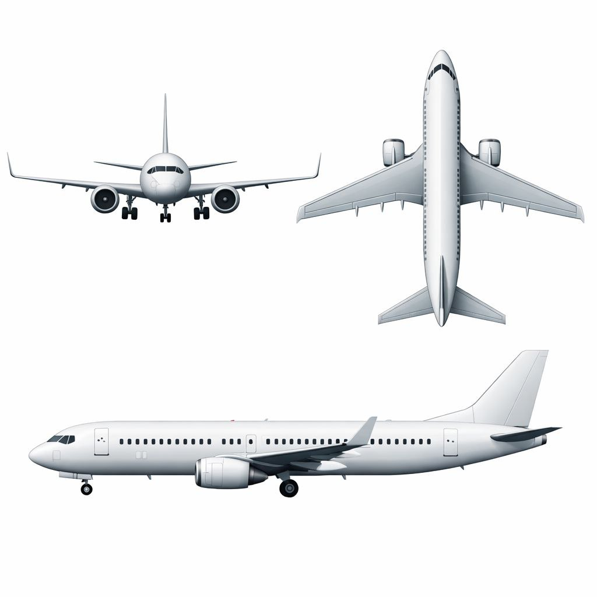

# Raport Techniczny: Proces Modelowania 3D Nowoczesnego Samolotu

## 1. Skład zespołu i podział odpowiedzialności
* **Mikita Tsarkovich:** Modelowanie bazy konstrukcyjnej (kadłuba), opracowanie aerodynamicznej geometrii kokpitu oraz konfiguracja materiałów matowych.
* **Daniil Yakaulev:** Przygotowanie dokumentacji referencyjnej, modelowanie skrzydeł oraz opracowanie zestawu drobnych detali zewnętrznych kadłuba poprawiających realizm modelu.
* **Ivan Berezka:** Opracowanie detali poszycia (okna), modelowanie jednostek napędowych, konstrukcja systemów podwozia oraz finalna integracja techniczna i hierarchizacja obiektów.

## 2. Metodologia i etapy pracy
Proces tworzenia modelu został podzielony na kilka kluczowych faz, co pozwoliło na zachowanie spójności przy pracy zespołowej:

### A. Przygotowanie i analiza (Blocking)
Prace rozpoczęły się od ustawienia precyzyjnych rzutów ortograficznych (widok z góry, boku i przodu), co było fundamentem dla zachowania proporcji nowoczesnego odrzutowca pasażerskiego. Poniżej przedstawiono wykorzystane w projekcie materiały referencyjne:

Mikita przygotował główną bryłę kadłuba z cylindra, stosując techniki *Proportional Editing* oraz *Subdivision Surface*, aby uzyskać płynne, aerodynamiczne przejścia między sekcjami samolotu.

### B. Modelowanie skrzydeł i powierzchni nośnych
Skrzydła zostały wymodelowane jako oddzielne obiekty typu *low-poly*. Wykorzystano modyfikator **Mirror**, co pozwoliło na jednoczesną edycję obu skrzydeł przy zachowaniu idealnej symetrii względem osi kadłuba. Szczególną uwagę poświęcono kątowi nachylenia skrzydeł (dihedral angle) oraz ich grubości, aby odpowiadały technicznym wzorcom lotnictwa.

### C. Detalizacja i mechanika (Engine & Landing Gear)
Ivan zajął się budową silników turbowentylatorowych (turbofan). Zastosowano tutaj technikę modelowania modułowego – od podstawowego cylindra, poprzez operacje *Inset* i *Extrude*, aż po nadanie głębi wlotom powietrza. Równolegle powstał system podwozia (landing gear), który musiał zostać geometrycznie dopasowany do dolnej części kadłuba.

### D. Elementy wykończeniowe i mikrodetaile
Aby model nie wyglądał na pusty, zastosowano techniczne optymalizacje – okna pasażerskie zostały rzutowane na kadłub za pomocą narzędzia **Knife Project** i pokryte czarnym, lustrzanym materiałem (tzw. metoda "Black Glass"), co wyeliminowało potrzebę modelowania skomplikowanego wnętrza. Daniil uzupełnił projekt o szereg drobnych detali rozmieszczonych wzdłuż poszycia, takich jak anteny i wypukłości techniczne, które nadały modelowi profesjonalnego charakteru bez nadmiernego zagęszczania siatki poligonów.

## 3. Optymalizacja i shading
W końcowej fazie zespół skupił się na jakości wizualnej i technicznej czystości pliku:
* **Shading:** Użyto opcji *Shade Smooth* w połączeniu z *Auto Smooth*, co pozwoliło zachować ostre krawędzie mechaniczne przy jednoczesnym wygładzeniu obłych części kadłuba.
* **Cleanup:** Przeprowadzono czyszczenie geometrii poprzez usuwanie podwójnych wierzchołków (*Merge by Distance*).
* **Materiały:** Skonfigurowano shadery tak, aby odróżnić matowe elementy poszycia od błyszczących powierzchni okien i metalicznych części silnika.

## 4. Hierarchia i finalna integracja
Ostatnim krokiem było połączenie wszystkich elementów w jedną strukturę. Wykorzystano relację **Parenting (Ctrl+P)**. Kadłub został ustawiony jako obiekt nadrzędny (Parent), dzięki czemu wszystkie skrzydła, silniki i drobne detale poruszają się wraz z nim, zachowując jednocześnie możliwość niezależnej edycji każdego komponentu.
